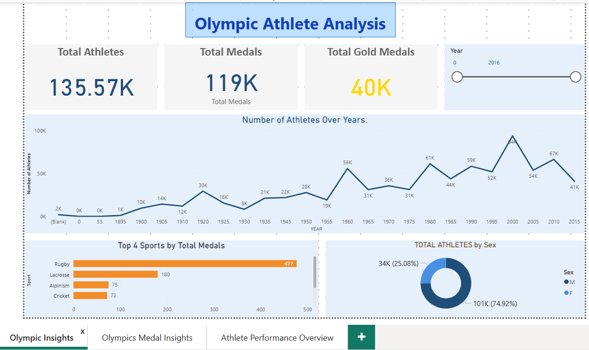
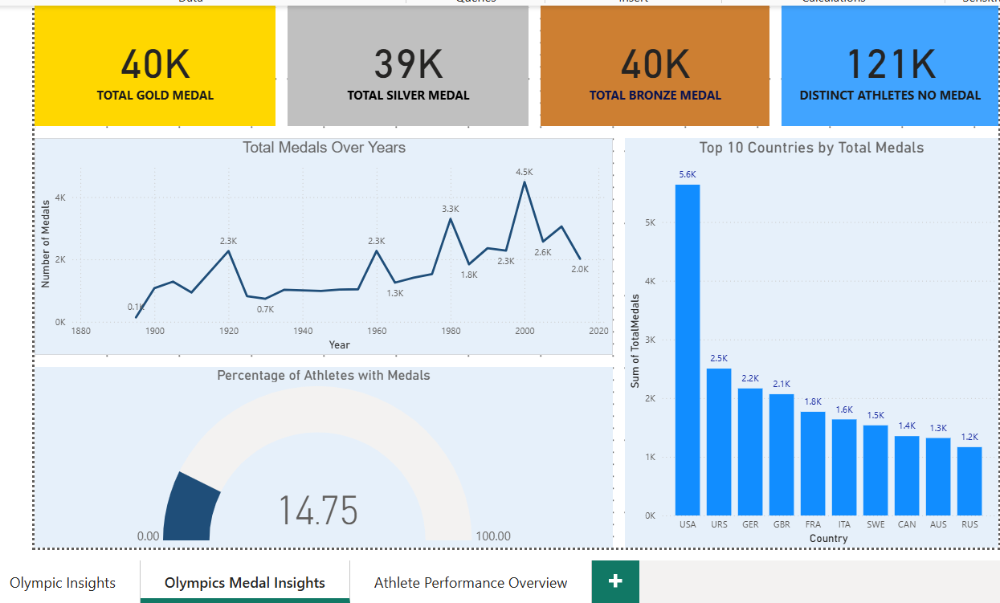
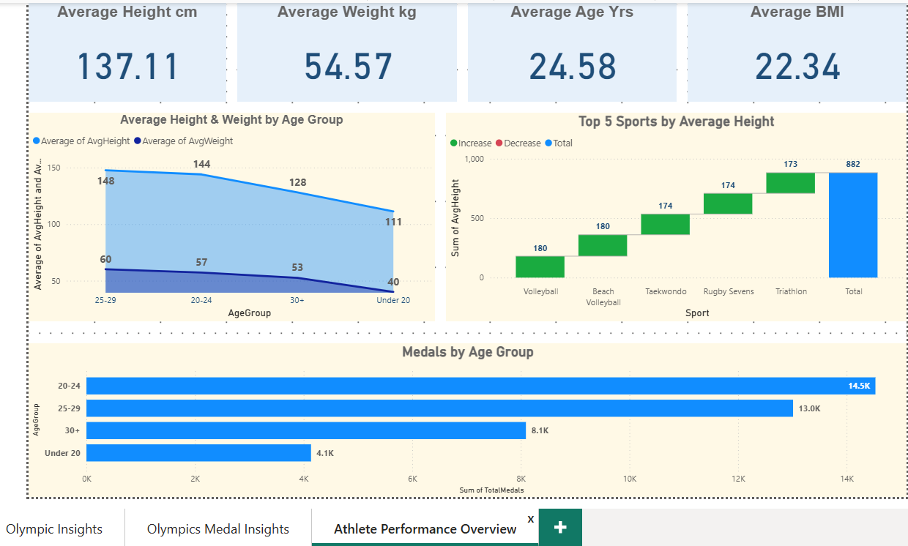

# 🏅 Olympics Analytics Dashboard

An interactive **Power BI project** analyzing Olympic athlete performance, medals, and participation trends.  
Built using **MySQL + Excel + Power BI + DAX**.  

This project demonstrates data analysis, dashboard creation, and KPI computation to explore patterns in Olympic data.

---

## 📊 Dashboards

### 1️⃣ Olympic Insights
**KPIs:**  
- Total Athletes  
- Total Medals  
- Total Gold Medals  

**Charts / Visuals:**  
- Number of Athletes Over Years  
- Top 4 Sports by Total Medals  
- Total Athletes by Sex 

---

### 2️⃣ Olympic Medal Insights
**KPIs:**  
- Total Gold Medals  
- Total Silver Medals  
- Total Bronze Medals  
- Athletes with No Medal  

**Charts / Visuals:**  
- Total Medals Over Years  
- Top 10 Countries by Total Medals  
- Percentage of Athletes with Medals  

---

### 3️⃣ Athlete Performance
**KPIs:**  
- Average Height  
- Average Weight  
- Average Age  
- Average BMI  

**Charts / Visuals:**  
- Average Height & Weight by Age Group  
- Top 5 Sports by Average Height  
- Medals by Age Group  

---

## ⚙️ Tools Used
- **Excel** → Data cleaning, preparation, and computing derived metrics  
- **MySQL** → Data storage, queries & preparation  
- **Power BI** → Dashboard creation  
- **DAX** → KPI calculations  

---

## 📥 Resources
- **Power BI File (.pbix)**:  
👉 [Download PBIX File](https://drive.google.com/file/d/10_Itt3zM0l_lNMhxFpsyOamOSGoDvSu1/view?usp=sharing)  
- **SQL Queries**:  
👉 [View SQL Queries](./Olympics_Queries.sql)  
- **DAX Formulas**:  
👉 [View DAX Formulas](./Olympics_DAX.txt)  
- **Cleaned Excel Dataset** (ready for analysis, 269,733 rows):  
👉 [Download Excel File](https://drive.google.com/file/d/1Nm-0A_--Jk49GOzEOWzYonIXonbsVeEN/view?usp=sharing)  

**Data Cleaning / Pipeline Notes:**  
- Original raw dataset contained missing values and inconsistent column names.  
- Cleaned and processed in **Excel**:  
  - Removed rows with missing `Height`, `Weight`, `Age`, or `MedalWon`.  
  - Standardized text fields (`Sport`, `Country`, `MedalWon`).  
  - Computed derived metrics:  
    - **BMI** = `Weight / (Height/100)^2`  
    - **AgeGroup** = `<20`, `20–24`, `25–29`, `30+`  
- Ensured numeric columns are properly formatted for analysis.  
- Final cleaned dataset contains **269,733 rows** ready for Power BI dashboards.  

---

## 🚀 Key Insights
- Athlete participation has increased steadily across Olympic years.  
- **USA, Russia, Germany** dominate total medal counts.  
- Physical metrics (BMI, Height, Weight) show clear patterns across sports.  
- Age group **20–24** has the highest medal wins.  
- Top-performing sports: **Rugby, Lacrosse, Alpinism, Cricket**.  
- **Male athletes outnumber female athletes** across the dataset.  
- Average athlete height and weight differ significantly by sport.  

---
 
✦ Created as part of my Data Analytics Portfolio ✦

